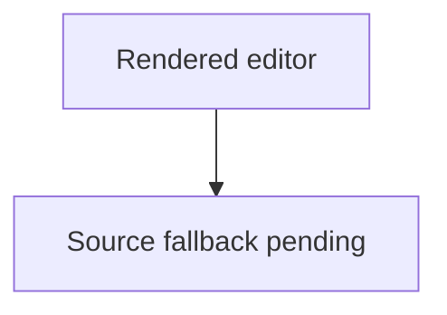

# Rendered Markdown Editor Smoke Test

Use this file to verify the same-tab rendered Markdown editor in a local Zed
build.

## Start

1. Open this file in Zed.
2. Press `ctrl-shift-m` on Windows/Linux or `cmd-shift-m` on macOS.
3. Verify this tab changes from Markdown source into rendered document view.
4. Press the same shortcut again and verify the source editor returns in the
   same tab.

## Paragraph Editing

Place the caret at the end of this paragraph in rendered mode and type a short
word. The inserted text should appear in this paragraph after the Markdown
source is restored.

## Inline Formatting

Select the word sample below in rendered mode and use the formatting shortcuts.

sample

Expected behavior:

- `ctrl-b` / `cmd-b` toggles `**sample**`.
- `ctrl-i` / `cmd-i` toggles `*sample*`.
- ``ctrl-` `` / ``cmd-` `` toggles inline code.

## Block Formatting

Select these lines and try the block commands:

Alpha
Beta
Gamma

Expected behavior:

- `ctrl-alt-1` / `cmd-alt-1` converts selected lines to level 1 headings.
- `ctrl-alt-0` / `cmd-alt-0` converts selected headings back to paragraphs.
- `ctrl-shift-8` / `cmd-shift-8` toggles unordered list markers.
- `ctrl-shift-7` / `cmd-shift-7` toggles ordered list markers.
- `ctrl-shift-9` / `cmd-shift-9` toggles unchecked task list markers.

## Checkbox Editing

- [ ] Toggle this task from rendered mode.
- [x] Toggle this completed task from rendered mode.

Expected behavior: clicking the checkbox updates only the source marker.

## Copy And Cut

Select the rendered word below.

**VisibleOnly**

Expected behavior:

- Copy copies `VisibleOnly`, not `**VisibleOnly**`.
- Cut copies `VisibleOnly` and removes the mapped source text, leaving the
  surrounding Markdown syntax intact.

## Current Fallback Cases

The first testable milestone does not yet provide rich source fallback editors
for these blocks. Use `ctrl-shift-m` / `cmd-shift-m` to return to source mode
before editing them.

```rust
fn rendered_markdown_smoke_test() {
    println!("source fallback is still pending");
}
```



<div>
  Raw HTML editing still belongs in source mode for now.
</div>
